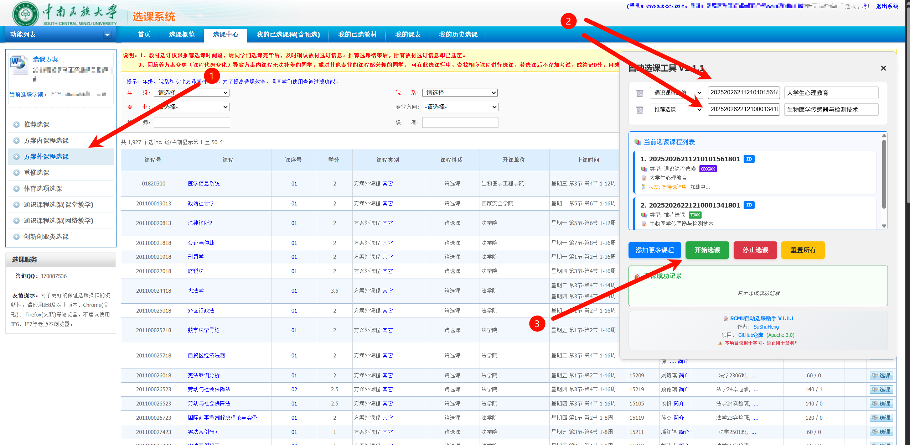

# SCMU_CC_Helper

---

# 中南民族大学自动选课助手

🚀 一个专为中南民族大学（SCMU）学生设计的自动化课程注册助手，帮助学生快速抢到心仪的课程。**V1.1.1全新升级，支持校园网/VPN双环境访问！**

## ✨ 功能特性

- **🎯 自动选课**: 智能检测课程空位并自动注册
- **🌐 双网络支持**: 支持校园网内部访问和VPN公网访问，智能切换环境 (V1.1.1 新增)
- **🔄 实时监控**: 500ms轮询间隔，不错过任何选课机会
- **📚 多课程支持**: 同时抢多个课程，提高成功率
- **🧪 实验班支持**: 自动尝试不同实验班，增加选课成功概率
- **💾 数据持久化**: 本地存储课程数据，页面刷新后自动恢复 (V1.0.4 新增)
- **🎨 友好界面**: 可拖拽的控制面板，支持悬浮按钮、完整面板、迷你状态三种状态
- **📊 状态监控**: 实时查看选课状态和进度，支持状态弹窗详情查看
- **📏 动态面板高度**: 面板高度500px-800px自动调整，根据课程数量智能伸缩 (V1.1.1 新增)
- **💡 课程名即时保存**: 失去焦点自动保存，防抖技术避免频繁存储，确保数据不丢失 (V1.1.1 新增)
- **⚡ 高性能**: 使用ES6+现代JavaScript技术，运行流畅
- **🔄 课程管理**: 支持课程添加、删除、更新，运行时动态管理
- **🎯 智能滚动**: 课程数量过多时自动启用滚动容器，保持界面整洁
- **🎓 7种课程类型**: 支持推荐选课、方案内选课、方案外选课、重修选课等7种类型 (V1.1.0 新增)
- **📝 课程名称管理**: 支持为课程添加自定义名称，便于识别管理

## 🚀 使用方法
*注意!脚本程序中的"课程ID"并非选课页面所展示的课程ID！获取方法如下:*
- step 01： 启动浏览器的开发者工具，点击`检查网页元素`并选取你想要选择的课程对应的"选课"按钮
**
- step 02： 获取下方图片方框中展示的字符串内容，去除首尾的引用号并复制字符串中的内容填入脚本面板的"课程ID"输入框
**

- step 03： 点击 `我的已选课程(含预选)`附近的"抢课"悬浮按钮打开脚本程序主面板

  

- step 04： 在选课之前要进入`选课中心-方案外课程选课`,将获取的课程ID输入后即可开始抢课

  

- step 05：抢课成功并结束后，可以刷新选课页面并进入 `我的已选课程(含预选)`查看抢课是否成功

### 方法一：单文件版本 (推荐新手)

使用 `dist/course-helper.js` 单文件版本，适合初学者快速上手：

1. **登录选课系统**

   - 打开浏览器，访问：[https://xk.webvpn.scuec.edu.cn/xsxk/](https://xk.webvpn.scuec.edu.cn/xsxk/)
   - 使用你的学号和密码登录
2. **打开开发者工具**

   - 按下 `F12` 键打开浏览器开发者工具
   - 切换到 "Console" (控制台) 标签页
3. **复制粘贴代码**

   - 复制 `dist/course-helper.js` 的完整内容
   - 粘贴到控制台中，按回车执行
4. **开始选课**

   - 页面右上角会出现选课助手控制面板
   - 输入课程ID，点击"开始选课"即可

**优点**：一键运行，无需配置，适合新手用户

### 方法二：模块化版本 (适合开发者)

使用 `src/` 目录下的模块化脚本，适合有一定JavaScript基础的用户：

1. **下载项目文件**

   ```bash
   git clone https://github.com/sushuheng/scmu_cc_helper.git
   cd scmu_cc_helper
   ```
2. **在浏览器中依次导入模块**

   ```javascript
   // 在控制台中依次执行
   import { CONFIG } from './src/config.js';
   import { courseManager } from './src/course-registration.js';
   import { uiController } from './src/ui-controller.js';
   ```
3. **初始化界面**

   ```javascript
   uiController.initialize();
   ```
4. **手动控制选课过程**

   ```javascript
   // 添加课程
   courseManager.addCourse('你的课程ID');
   
   // 开始选课
   await courseManager.initialize();
   
   // 查看状态
   console.log(courseManager.getStatus());
   
   // 停止选课
   courseManager.stopLoop();
   ```

**优点**：模块化设计，可自定义功能，适合二次开发

### 方法三：油猴版本 (推荐自动运行)

使用 `dist/tampermonkey-course-helper.js` 油猴脚本版本，实现自动化加载运行：

1. **安装油猴扩展**

   - Chrome浏览器：访问 [Chrome Web Store](https://chrome.google.com/webstore/detail/tampermonkey/dhdgffkkebhmkfjojejmpbldmpobfkfo) 安装Tampermonkey
   - Firefox浏览器：访问 [Firefox Add-ons](https://addons.mozilla.org/firefox/addon/tampermonkey/) 安装Tampermonkey
   - Edge浏览器：访问 [Edge Add-ons](https://microsoftedge.microsoft.com/addons/detail/tampermonkey/iikmkjmpaadaobahmlepeloendndfphd) 安装Tampermonkey
2. **创建新脚本**

   - 点击浏览器工具栏中的油猴图标
   - 选择"管理面板"，进入脚本管理页面
   - 点击"➕"创建新脚本按钮
3. **复制粘贴代码**

   - 清除编辑器中的默认模板代码
   - 复制 `dist/tampermonkey-course-helper.js` 的完整内容
   - 粘贴到油猴编辑器中
4. **保存并启用**

   - 按 `Ctrl+S` 保存脚本
   - 确保脚本开关处于启用状态
   - 脚本将自动在选课系统页面运行
5. **访问选课系统**

   - 打开浏览器访问：[https://xk.webvpn.scuec.edu.cn/xsxk/](https://xk.webvpn.scuec.edu.cn/xsxk/)
   - 登录你的学号和密码
   - 页面右上角会自动出现选课助手控制面板
   - 直接开始使用，无需手动执行任何代码

**优点**：自动运行，无需手动操作，一次安装永久使用，最适合日常使用

### 三种版本对比

| 特性       | 单文件版本  | 模块化版本    | 油猴版本    |
| ---------- | ----------- | ------------- | ----------- |
| 使用难度   | ⭐ 简单     | ⭐⭐⭐ 中等   | ⭐⭐ 简单   |
| 功能完整性 | ✅ 完整     | ✅ 完整       | ✅ 完整     |
| 可定制性   | ❌ 不可定制 | ✅ 高度可定制 | ⭐⭐ 有限   |
| 自动运行   | ❌ 手动执行 | ❌ 手动执行   | ✅ 自动运行 |
| 安装复杂度 | ⭐⭐ 简单   | ⭐⭐⭐ 中等   | ⭐ 简单     |
| 适合人群   | 新手用户    | 开发者用户    | 所有用户    |
| 二次开发   | ❌ 不支持   | ✅ 完全支持   | ⭐ 有限支持 |

## 📋 系统要求

- **浏览器**: Chrome 60+, Firefox 55+, Safari 10+, Edge 79+
- **JavaScript**: 支持ES6+ (ECMAScript 2015+)
- **网络环境**:
  - 校园网内部：支持 `http://xk.scuec.edu.cn/xsxk/` 访问 (V1.1.1新增)
  - 公网VPN：支持 `https://xk.webvpn.scuec.edu.cn/xsxk/` 访问
  - 智能检测：脚本自动识别当前网络环境并适配
- **权限**: 已登录中南民族大学选课系统
- **扩展**: 使用油猴版本需安装Tampermonkey扩展程序

### 🎮 基本操作说明

1. **添加课程**

   - 在"输入课程ID"框中输入要抢的课程ID
   - 可选填入课程名称便于识别
   - 选择合适的课程类型（推荐使用默认的"方案外选课"）
   - 点击"添加更多课程"可继续添加其他课程

2. **选择课程类型** (V1.1.0 新功能)

   | 课程类型 | 代码 | 适用场景 | 说明 |
   |---------|------|----------|------|
   | 推荐选课 | TJXK | 系统推荐的专业课程 | 优先选课，成功率高 |
   | 方案内选课 | BFAK | 培养方案内的必修课程 | 专业必修课 |
   | 方案外选课 | KZYXK | 培养方案外的选修课程 | **推荐使用** |
   | 重修选课 | CXXK | 重修之前未通过的课程 | 挂科重修 |
   | 体育选择课 | TYKXK | 体育类选修课程 | 体育选修 |
   | 通识课程选修 | QXGXK | 通识教育选修课程 | 需要志愿等级 |
   | 创新创业类选修课 | CXCY | 创新创业教育类选修 | 创新课程 |

3. **开始选课**

   - 确认已输入所有要抢的课程ID和选择了正确的课程类型
   - 点击"开始选课"按钮
   - 系统会自动开始监控并选课
   - 不同课程类型会使用对应的API端点进行选课

4. **监控进度**

   - 控制台会显示实时的选课日志
   - 点击"查看状态"查看选课进度
   - 成功抢到的课程会在日志中显示✅
   - 界面底部会显示作者信息和版本信息

### 🔧 高级功能

- **🌐 智能网络适配**: 自动检测校园网/VPN环境，无缝切换访问模式 (V1.1.1新增)
- **💾 本地数据持久化**: 课程信息、名称、选课状态自动保存，刷新页面后自动恢复
- **🎨 三态UI系统**: 悬浮按钮、完整面板、迷你状态面板智能切换
- **📏 动态面板高度**: 根据课程数量智能调整面板高度(500px-800px)，优化界面布局 (V1.1.1新增)
- **💡 课程名即时保存**: 失去焦点自动保存，防抖技术确保数据完整性 (V1.1.1新增)
- **🔄 运行时课程管理**: 选课进行中可动态添加/删除/更新课程
- **🎯 课程名称管理**: 支持为课程添加自定义名称，便于识别管理
- **⚠️ 智能确认机制**: 删除课程、重置系统、关闭程序时的安全确认
- **🛑 自动停止功能**: 课程列表为空时自动停止选课，避免无效请求
- **📊 状态详情弹窗**: 可拖拽的状态面板，显示详细选课进度和运行时间
- **🎯 竞态条件修复**: 解决UI初始化时序问题，确保数据正确加载
- **🎮 智能滚动容器**: 超过阈值课程时自动启用滚动，保持界面整洁
- **🔄 一键关闭程序**: 安全关闭功能，自动清理所有定时器和UI元素
- **📈 运行时间统计**: 实时显示选课运行时间，精确到秒

## 🔧 配置选项

在 `src/config.js` 中可以自定义以下配置：

```javascript
// API配置
API: {
    BASE_URL: 'https://xk.webvpn.scuec.edu.cn/xsxk',
    ENDPOINTS: {
        GET_EXPERIMENTAL_CLASS: '/loadData.xk?method=getGljxb&jxbid=',
        COURSE_REGISTRATION: '/xkOper.xk?method=handleKzyxk&jxbid='
    }
}

// 选课配置
GRAB: {
    POLLING_INTERVAL: 500,                    // 轮询间隔（毫秒）
    REQUEST_TIMEOUT: 10000,                   // 请求超时时间（毫秒）
    MAX_RETRY_COUNT: 3,                       // 最大重试次数
    COURSE_FULL_KEYWORDS: ['课程已满', '已选满'] // 课程满员检测关键词
}

// UI配置
UI: {
    SCROLLABLE_CONTAINER: {
        MAX_COURSES_BEFORE_SCROLL: 4,         // 超过多少课程启用滚动
        CONTAINER_HEIGHT: '250px',            // 滚动容器高度
        SCROLLBAR_WIDTH: '8px'               // 滚动条宽度
    }
}

// Z-Index层级管理
Z_INDEX: {
    BASE_LAYER: 9999,        // 基础UI组件
    NOTIFICATION: 10000,     // 通知消息
    MODAL: 10001,           // 普通弹窗
    DIALOG: 10002,          // 确认对话框
    OVERLAY: 10003,         // 全屏遮罩
    TOPMOST: 10004          // 最高层级
}
```

## 📁 项目结构

```
scmu_cc_helper/
├── src/                          # 源代码目录
│   ├── config.js                 # 配置文件 (V1.1.1 更新)
│   ├── course-registration.js    # 核心选课逻辑 (V1.1.1 更新)
│   ├── local-data-manager.js     # 本地数据管理器 (V1.1.1 更新)
│   └── ui-controller.js          # 用户界面控制 (V1.1.1 更新)
├── docs/                         # 文档目录
│   ├── installation-guide.md     # 详细安装教程
│   ├── api-reference.md          # API参考文档
│   ├── troubleshooting.md        # 故障排除
│   ├── v1.1.1-release-notes.md   # V1.1.1发布说明 (新增)
│   ├── v1.1.0-release-notes.md   # V1.1.0发布说明
│   ├── course-types-guide.md     # 课程类型使用指南
│   ├── campus-network-guide.md   # 校园网配置指南 (新增)
│   └── migration-guide.md        # 版本迁移指南
├── examples/                     # 示例代码
│   └── usage-examples.js         # 使用示例
├── dist/                         # 发布文件 (V1.1.1)
│   ├── course-helper.js          # 单文件版本 (V1.1.1)
│   └── tampermonkey-course-helper.js  # 油猴脚本版本 (V1.1.1)
└── README.md                     # 项目说明文档
```

## 🛠️ 技术栈

- **语言**: JavaScript ES6+
- **核心特性**:
  - Arrow Functions (箭头函数)
  - Template Literals (模板字面量)
  - const/let 变量声明
  - Promise 异步处理
  - Fetch API 网络请求
  - DOM Manipulation (DOM操作)
  - CustomEvent 事件系统 (V1.0.4 新增)
  - GM_setValue/GM_getValue 本地存储 (V1.0.4 新增)
- **架构**: 模块化设计，分离关注点，事件驱动架构
- **框架**: 纯原生JavaScript，无外部依赖
- **设计模式**: 观察者模式、单例模式、工厂模式

## 📚 详细文档

- [📖 详细安装教程](docs/installation-guide.md) - 新手必读的完整教程
- [🎓 课程类型指南](docs/course-types-guide.md) - 7种课程类型详细说明 (V1.1.0 新增)
- [📋 V1.1.0发布说明](docs/v1.1.0-release-notes.md) - 最新版本功能介绍 (V1.1.0 新增)
- [🔄 版本迁移指南](docs/migration-guide.md) - 从V1.0.4升级到V1.1.0 (V1.1.0 新增)
- [🔧 API参考文档](docs/api-reference.md) - 开发者API说明
- [❓ 故障排除](docs/troubleshooting.md) - 常见问题解决方案
- [💡 使用示例](examples/usage-examples.js) - 代码示例和最佳实践

## ⚠️ 重要提醒

### 安全须知

- 本工具仅用于合法的课程注册目的
- 请遵守学校选课系统的相关规定
- 不要过度频繁地请求，以免给服务器造成压力

### 使用建议

- 提前测试，熟悉工具操作
- 准备好多门备选课程
- 选课成功后及时停止程序
- 定期备份重要的选课信息

## 🤝 贡献指南

欢迎提交Issue和Pull Request来改进这个项目！

### 开发环境设置

1. 克隆本项目
2. 在浏览器中测试修改后的代码
3. 确保所有功能正常工作
4. 提交Pull Request

### 代码规范

- 使用ES6+语法
- 添加详细的中文注释
- 遵循模块化设计原则
- 保持代码简洁易读

## 👨‍💻 作者信息

- **作者**: SuShuHeng
- **个人主页**: [https://github.com/sushuheng](https://github.com/sushuheng)
- **许可证**: APACHE 2.0

## 📄 许可证与免责声明

本项目采用 [APACHE 2.0](LICENSE) 许可证。

### ⚠️ 商业使用限制

- 商业用途需要联系作者获得授权
- 禁止以盈利目的使用本软件
- 如需商业合作，请通过GitHub联系作者

### 🛡️ 免责声明

- **本项目仅用于学习目的**
- 使用者需要自行承担使用风险
- 请遵守中南民族大学选课系统的相关规定
- 作者不承担因使用本软件产生的任何后果

## 🙏 致谢

感谢中南民族大学提供的选课系统，以及所有为此项目做出贡献的开发者和用户。

## 🆕 版本更新日志

### V1.1.1 (2025-12-10) - 校园网支持与体验优化版本

#### 🎉 重大新增功能

- **🌐 校园网访问支持**
  - 支持校园网内部直接访问：`http://xk.scuec.edu.cn/xsxk/`
  - 保持VPN公网访问兼容：`https://xk.webvpn.scuec.edu.cn/xsxk/`
  - 智能网络环境检测，自动切换API端点配置
  - 无缝用户体验，无需手动配置网络环境

- **📏 动态面板高度控制**
  - 面板高度范围：500px-800px智能调整
  - 基于课程数量自动计算最合适高度
  - 少量课程时收缩至最小高度，大量课程时扩展至最大高度
  - 课程数量超过阈值时自动启用滚动容器

- **💡 课程名保存机制优化**
  - 失去焦点时立即保存课程名称
  - 防抖技术避免频繁存储操作
  - 增强课程名恢复逻辑，支持多种数据格式
  - 修复部分课程名在页面刷新后丢失的问题

#### 🔧 技术改进

- **网络配置架构升级**
  - 新增校园网URL配置支持
  - 动态BASE_URL获取机制
  - 环境检测函数自动适配不同网络环境

- **UI系统增强**
  - 新增动态高度计算函数
  - 课程数量变化时自动更新面板尺寸
  - 自定义滚动条样式优化

- **数据持久化改进**
  - 修复课程名恢复的竞态条件
  - 增强数据格式兼容性
  - 添加防抖存储机制

#### 🐛 问题修复

- **课程名保存问题修复**
  - 解决输入课程名后刷新页面部分名称丢失
  - 增强数据恢复的可靠性和完整性
  - 优化存储时机和频率

- **界面体验优化**
  - 面板高度自适应不同屏幕和内容量
  - 减少固定高度带来的空间浪费
  - 改善滚动容器的用户体验

#### 📁 文件更新

```
src/ (全部更新至V1.1.1)
├── config.js                 # 新增：校园网配置、动态面板高度配置
├── course-registration.js    # 优化：网络环境适配
├── local-data-manager.js     # 增强：课程名保存和恢复机制
└── ui-controller.js          # 重大更新：动态高度控制、课程名保存优化

dist/ (全部更新至V1.1.1)
├── course-helper.js          # 功能对等：单文件版本
└── tampermonkey-course-helper.js  # 功能对等：油猴版本，新增校园网URL匹配
```

---

### V1.1.0 (2025-12-09) - 多课程类型支持版本

#### 🎉 重大新增功能

- **🎓 7种课程类型支持**
  - 推荐选课 (TJXK)：系统推荐的专业课程，优先选课
  - 方案内选课 (BFAK)：培养方案内的必修课程
  - 方案外选课 (KZYXK)：培养方案外的选修课程，**推荐使用**
  - 重修选课 (CXXK)：重修之前未通过的课程
  - 体育选择课 (TYKXK)：体育类选修课程
  - 通识课程选修 (QXGXK)：通识教育选修课程，支持志愿等级
  - 创新创业类选修课 (CXCY)：创新创业教育类选修课程

- **📝 增强的课程名称管理**
  - 支持为每门课程添加自定义名称
  - 名称持久化存储，页面刷新后保持
  - 友好的默认名称提示
  - 实时名称更新和验证

#### 🔧 技术架构升级

- **🔄 版本功能完全对等**
  - 单文件版本、油猴版本、模块化版本功能完全一致
  - 统一的API接口和行为表现
  - 一致的用户体验和数据持久化

- **💾 数据持久化优化**
  - 支持课程类型的本地存储
  - 增强的数据版本管理 (V1.0.0 → V2.0.0)
  - 更可靠的数据恢复机制
  - 跨版本兼容性保证

#### 📊 用户界面改进

- **🎨 课程类型选择界面**
  - 直观的课程类型下拉选择
  - 类型说明和使用场景提示
  - 智能默认选择推荐类型

- **📈 增强的状态显示**
  - 显示每门课程的类型信息
  - 成功记录和统计功能
  - 运行时间和性能监控

#### 🐛 重要问题修复

- **🏁 竞态条件彻底修复**
  - 完善的事件监听时序管理
  - 可靠的数据加载和恢复流程
  - 全面的错误处理和重试机制

- **🔧 内存管理优化**
  - 自动清理无效引用和定时器
  - 优化DOM操作和事件监听
  - 减少内存泄漏风险

#### 📁 文件结构更新

```
src/ (全部更新至V1.1.0)
├── config.js                 # 新增：7种课程类型配置
├── course-registration.js    # 增强：课程类型支持
├── local-data-manager.js     # 优化：数据版本管理
└── ui-controller.js          # 新增：课程类型选择界面

dist/ (全部更新至V1.1.0)
├── course-helper.js          # 功能对等：单文件版本
└── tampermonkey-course-helper.js  # 功能对等：油猴版本

docs/ (新增文档)
├── v1.1.0-release-notes.md   # 本发布说明
├── course-types-guide.md     # 课程类型详细指南
└── migration-guide.md        # 版本迁移指南
```

### V1.0.4 (2025-12-03) - 数据持久化版本

#### 🎉 重大新增功能

- **💾 本地数据持久化系统**
  - 新增 `LocalDataManager` 类，支持课程数据自动保存
  - 课程ID、名称、选课状态实时保存到本地存储
  - 页面刷新后自动恢复所有课程信息和选课状态
  - 支持油猴脚本的 GM_setValue/GM_getValue 存储

- **🎨 三态UI系统重构**
  - 悬浮按钮：初始状态，点击展开控制面板
  - 完整面板：包含所有课程管理和控制功能
  - 迷你状态面板：选课进行中的实时状态显示

---

## 🎯 未来计划

### V1.1.1 计划功能
- [ ] 课程冲突检测和智能提醒
- [ ] 批量课程类型设置
- [ ] 选课策略智能推荐
- [ ] 更丰富的统计和导出功能
- [ ] 多账户支持和快速切换

---

**❤️ 前人种树，后人乘凉，本项目启发于作者[xql799](https://github.com/xql799)的[SCUEC_AutoRobClass](https://github.com/xql799/SCUEC_AutoRobClass)项目中提供的信息，欢迎大家前去给个Star!**

**⭐ 如果这个项目对你有帮助，请给个星标支持一下！**

**📧 有问题或建议？欢迎提交Issue或联系开发者。**

---

*最后更新时间: 2025年12月10日 (V1.1.1)*
